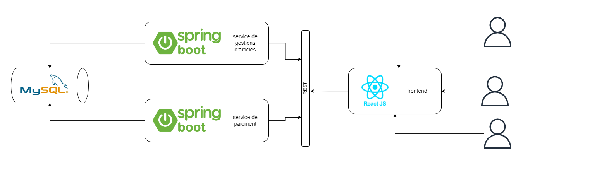

# Mise en place d'une architecture microservice


Dans cette architecture, nous avons trois applications.

* **Application frontend**: Cette application permettra aux clients de 

    * voir les articles
    * enregistrer un article
    * passer une commande 
    * voir les commandes enregistrées
* **Application backend des gestions articles**: Cette application expose des api
* **Application backend des paiements**: Cette application expose des api

Nos applications ont été deployées dans un environnement docker. La version de docker utilisée est **20.10.22**. Pour lancer nos applications nous lancons cette commande.
```markdown
docker compose up
```

